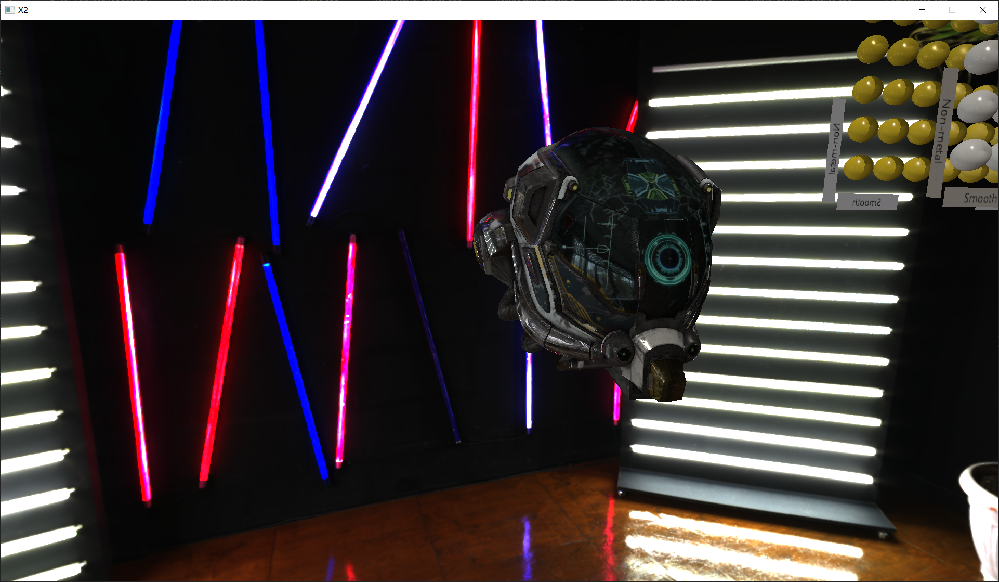
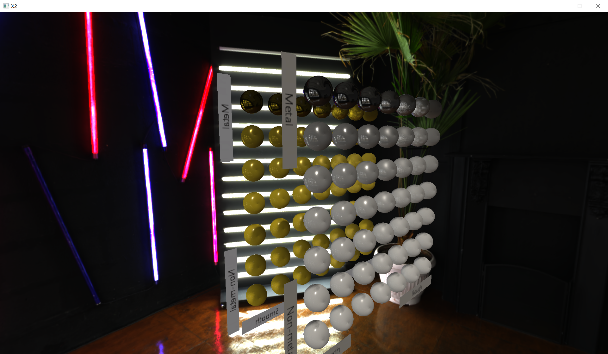
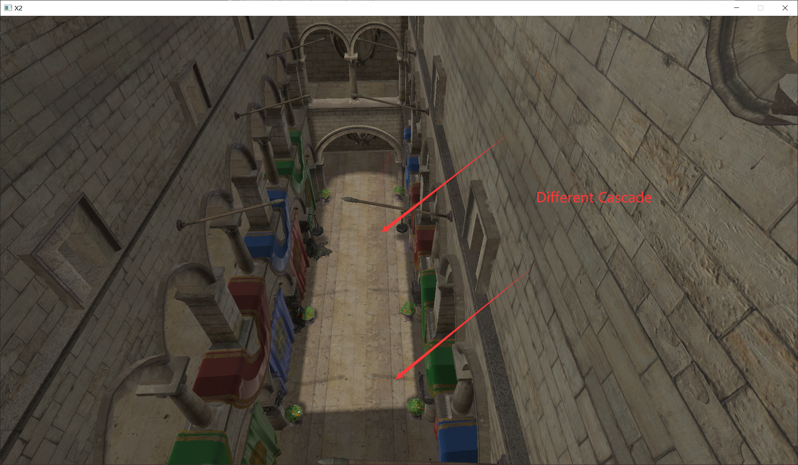
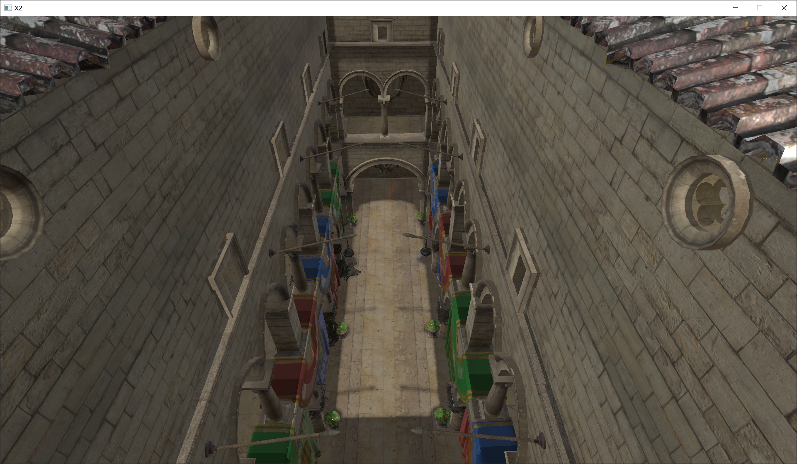
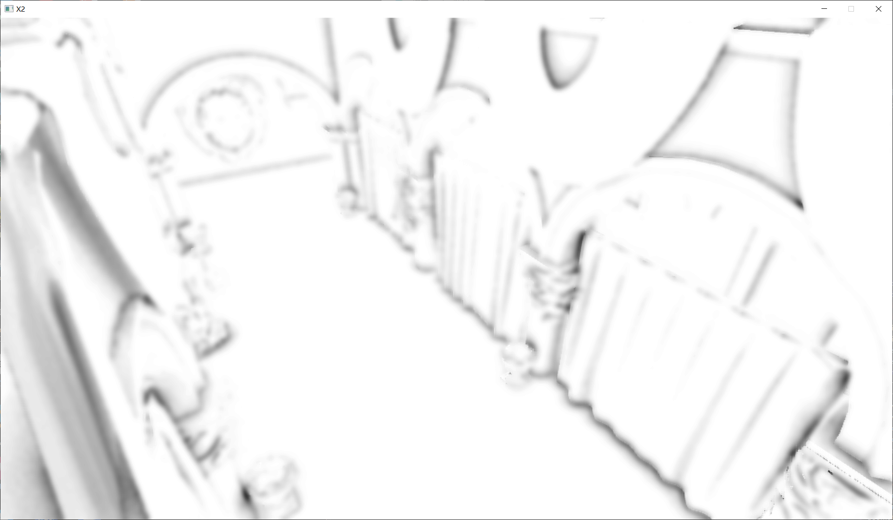

# X2_RenderingEngine
A rendering engine based on Vulkan, designed to implement various graphics algorithms.

## 项目简介
&nbsp;&nbsp;&nbsp;&nbsp;&nbsp;&nbsp;&nbsp;&nbsp;本项目为将基于Vulkan的渲染器进行再封装，通过复用性强的引擎结构代码，实现当前实时渲染领域较为常用的渲染算法，并尝试构建一些比较“高级”的引擎结构，如ECS,Material系统等。


## Build
```shell
git clone --recursive https://github.com/InCloudsBelly/X2_RenderingEngine.git
cd X2_RenderingEngine
run Build.bat

** 每次修改shader的源文件也可以通过Build.bat计算生成新的spv文件。
```
### Platform: &nbsp;Only Windows yet.
### Rendering API: Vulkan 
<br>

## Engine Features:
- [x] **Vulkan Rendering System**
- [x] **Asset Manager**
- [x] **DescriptorSet Manager**
- [x] **RenderPass Manager**
- [x] **Command System**
- [x] **Logic System (Manager Scene with Game Objects & Components (Simple ECS))**
- [x] **Input Manager (KeyBoard, Mouse, Stroll and etc.)**
- [x] **Camera & Controller**
- [x] **Lights & Manager**
- [x] **Behaviours**
- [x] **Simple Material System**

TODO:
- [ ] **ECS**
- [ ] **ImGui UI & UI Control**
- [ ] **Switching Renderers Online**
- [ ] **Material Visualization**
- [ ] **Scene Serialization & Deserialization**
- [ ] **...**
<br>

## Rendering Features:
- [x] **SwapChain**
- [x] **Background Rendering**
- [x] **Prefiltered EnvironmentMap**
- [x] **Prefiltered Irradiance**
- [x] **Hdr to 6-layer VkImage**
- [x] **IBL(Image Based Lighting)**
- [x] **Forward PBR(Physical Based Rendering)**
- [x] **Geometry Buffer**
- [x] **CSM(Cascaded Shadow Map)**
- [x] **Cascaded EVSM(Exponential Variance Shadow Maps)**

*To tell the truth, light cameras move with center of Cascaded frustum will cause Shadow edge flickering in EVSM*

- [x] **SSAO(Screen-Space Ambient Occlusion)**
- [x] **HBAO(Horizon-Based Ambient Occlusion)**
- [x] **GTAO(Ground-Truth Ambient Occlusion)**


TODO: 
- [ ] **MSAA，Multisample Anti-Aliasing**
- [ ] **SSAA，Supersample Anti-Aliasing**
- [ ] **SMAA，Subpixel Morphological Anti-Aliasing**
- [ ] **FXAA（Fast Approximate Anti-Aliasing）**
- [ ] **TXAA（Temporal Anti-Aliasing）**
- [ ] **SSR Screen Space Reflections**
- [ ] **SH Spherical Harmonic Lighting**
- [ ] **Tile Based Rendering**
- [ ] **PostProcess**
- [ ] **Depth Pelling**
- [ ] **...**

<br>

### 代码规范

1. 变量和函数一律小写字母开头
1. 全局变量以g_开头
1. 独立单词以首字母大写间隔
1. 仍需要进一步规范化

<br>

# 具体实现图片
## ForwardPBR 

<div align=center>


 图1 PBR_damagedHelmet
</div>


<div align=center>


 图2 PBR_MetallicRoughness_Balls
</div>

## Shadow

<div align=center>


 图3 CSM(with PCF)
</div>

<div align=center>


 图4 CSM(Sponza)
</div>


<br> 
<div align=center>
 

图5 Cascaded_EVSM(sponza)
</div>

&nbsp;&nbsp;&nbsp;&nbsp;&nbsp;&nbsp;&nbsp;&nbsp; 图5中看到Cascaded EVSM效果似乎也是不错的，但实际上个人认为Cascaded思路和EVSM确实不搭，因为Cascaded中为了保障阴影贴图像素质量稳定，常采用各个级联的光源相机跟随级联视锥体中心移动，但光源移动对于使用深度方差为参考的VSM（EVSM中的一部分）是有些致命的，（由于深度方差会频繁变化）。但EVSM在光源相机不变的时候效果还是很不错的。


## Ambient Occlusion
&nbsp;&nbsp;&nbsp;&nbsp;&nbsp;&nbsp;&nbsp;&nbsp; 以下的环境光遮蔽的效果图均以高斯滤波横向纵向各两次的效果为准。

<div align=center>
 

图6 SSAO
</div>

<div align=center>
 

图7 HBAO
</div>

<div align=center>
 

图8 GTAO
</div>


# 总结与评价
&nbsp;&nbsp;&nbsp;&nbsp;&nbsp;&nbsp;&nbsp;&nbsp; 目前整个项目还在一个积累阶段，未来将会考虑优先实现更多常用算法，后续也将会对引擎架构进行深度优化提升整体效果和可操作性。

<br>
<br>

# Credits
* Cherno [Hazel](https://github.com/TheCherno/Hazel)
* BoomingTech [Pilot](https://github.com/BoomingTech/Pilot)
* [vulkan-tutorial](https://vulkan-tutorial.com/)
* [HEngine](https://github.com/hebohang/HEngine)
* [MoravaEngine](https://github.com/dtrajko/MoravaEngine)
* [Air_TileBasedForward](https://github.com/freestriker/Air_TileBasedForward)
* [myGraphicAlgorithm](https://github.com/InCloudsBelly/myGraphicAlgorithm)
* [Vulkan_Renderer](https://github.com/InCloudsBelly/Vulkan_Renderer)
* [Xngine version 1.0](https://github.com/InCloudsBelly/Xngine)