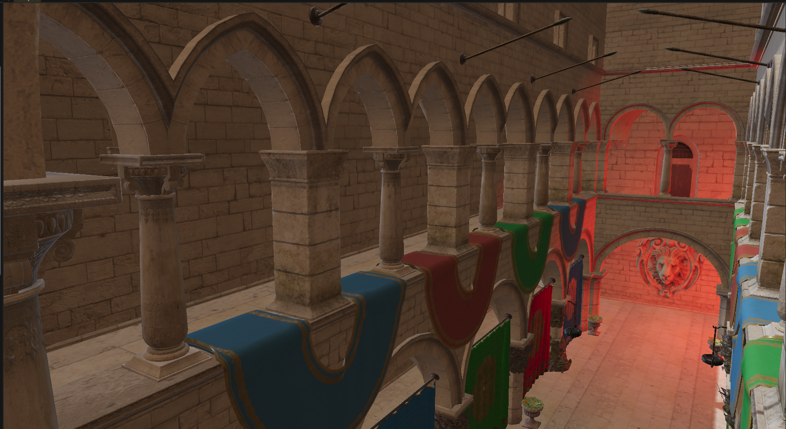
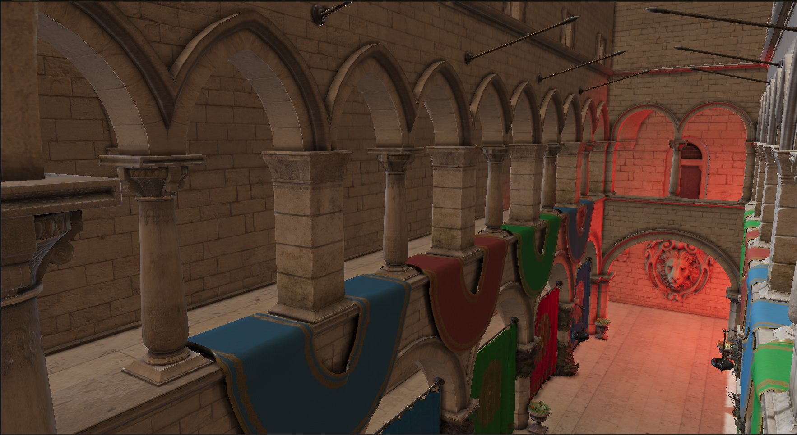

# X2_RenderingEngine
A rendering engine based on Vulkan, designed to implement various graphics algorithms.

## 项目简介
&nbsp;&nbsp;&nbsp;&nbsp;&nbsp;&nbsp;&nbsp;&nbsp;本项目为将基于Vulkan的渲染器进行再封装，通过复用性强的引擎结构代码，实现当前实时渲染领域较为常用的渲染算法，并尝试构建一些比较“高级”的引擎结构，如ECS,Material系统等。


## Build
```shell
git clone --recursive https://github.com/InCloudsBelly/X2_RenderingEngine.git
cd X2_RenderingEngine
run Build.bat
```

### Platform: &nbsp;Only Windows yet.
### Rendering API: Vulkan 
<br>

## Engine Features:
- [x] **Vulkan Rendering System**
- [x] **Asset Manager (Including Serilization Manager)**
- [x] **Simple ECS (using entt)**
- [x] **Simple Material System (Dynamic loading, Mainly used for PBR)**
- [x] **Multi-Layer (now only Editor Rendering Layer & ImGuiLayer)**
- [x] **Shader Compilation (now only support glsl)**
- [x] **Input Manager (KeyBoard, Mouse, Stroll and etc.)**
- [x] **ImGui UI & UI Control**


TODO:
- [ ] **Animation**
- [ ] **Introducing new Layers & new Components to implement new features, such as Physics, Audio, ScriptSystem & etc.**
- [ ] **Optimize Compilation and Code**
<br>

## Rendering Features:
- [x] **SwapChain**
- [x] **Skybox Rendering**
- [x] **Prefiltered EnvironmentMap & IrradianceMap**
- [x] **IBL(Image Based Lighting)**
- [x] **Deffered Rendering (NormalMap & DepthMap can be used for Algos)**
- [x] **PBR (Physical Based Rendering)**
- [x] **CSM(Cascaded Shadow Map)**
- [x] **HBAO(Horizon-Based Ambient Occlusion)**
- [x] **GTAO(Ground-Truth Ambient Occlusion)**
- [x] **Pre-Depth peeling**
- [x] **Blooming**
- [x] **Deinterleaving & Reinterleaving**
- [x] **Tile Based LightCulling**


TODO: 
- [ ] **SMAA(Subpixel Morphological Anti-Aliasing)**
- [ ] **FXAA(Fast Approximate Anti-Aliasing)**
- [ ] **TXAA(Temporal Anti-Aliasing)**
- [ ] **SSR Screen Space Reflections**
- [ ] **SH Spherical Harmonic Lighting**
- [ ] **Tile Based Rendering**
- [ ] **...**

<br>

### 代码规范

1. 变量一律小写字开头，函数则以大写字母开头，此两者中完整单词以大写开头作为间隔
1. 全局变量以g_开头
1. 独立单词以首字母大写间隔
1. 仍需要进一步规范化

<br>

# 具体实现图片
## 系统主界面 

<div align=center>


 图1 系统主界面
</div>
主要界面如图所示，文件浏览器可以拖动到一定位置进行交互以进行动态修改，目前主要应用到的Component主要是Transform和static Mesh Component，其对应的编辑逻辑也在图中进行展示，而左侧则是一些渲染的信息以及渲染选项调节，同样可以进行动态调节，下边展示的各种渲染算法也都可以在左侧UI界面进行调节。

## ForwardPBR 

<div align=center>


 图2 PBR1
</div>


<div align=center>


 图3 PBR2
</div>

## Shadow

<div align=center>


 图4 CSM级联
</div>

<div align=center>


 图5 CSM效果
</div>

<div align=center>


 图6 CSM各个级联的阴影贴图
</div>


## Ambient Occlusion

<div align=center>
 

图7 WithoutAO
</div>

<div align=center>
 

图8 HBAO
</div>

<div align=center>
 

图9 GTAO
</div>


## Tile Based LightingCulling

<div align=center>
 

图10 多光源下的Sponza
</div>

<div align=center>
 

图11 各个Tile的点光源计算复杂度


# 总结与评价
&nbsp;&nbsp;&nbsp;&nbsp;&nbsp;&nbsp;&nbsp;&nbsp; 目前整个项目还在一个积累阶段，未来将会考虑优先实现更多常用算法，后续也将会对引擎架构进行深度优化提升整体效果和可操作性。

<br>
<br>

# Credits
* Cherno [Hazel](https://github.com/TheCherno/Hazel)
* BoomingTech [Pilot](https://github.com/BoomingTech/Pilot)
* [vulkan-tutorial](https://vulkan-tutorial.com/)
* [HEngine](https://github.com/hebohang/HEngine)
* [MoravaEngine](https://github.com/dtrajko/MoravaEngine)
* [Air_TileBasedForward](https://github.com/freestriker/Air_TileBasedForward)
* [myGraphicAlgorithm](https://github.com/InCloudsBelly/myGraphicAlgorithm)
* [Vulkan_Renderer](https://github.com/InCloudsBelly/Vulkan_Renderer)
* [Xngine version 1.0](https://github.com/InCloudsBelly/Xngine)